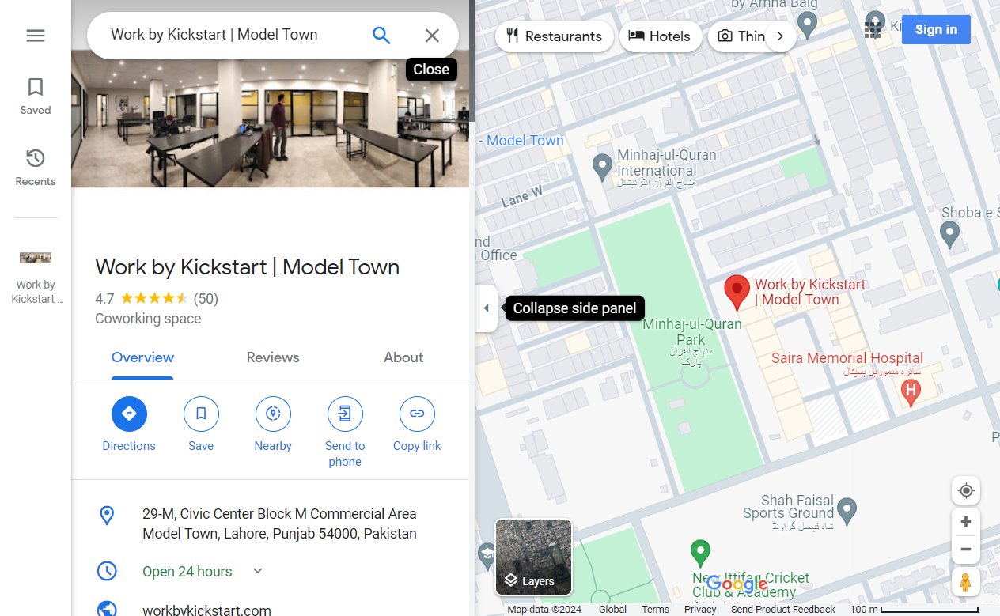
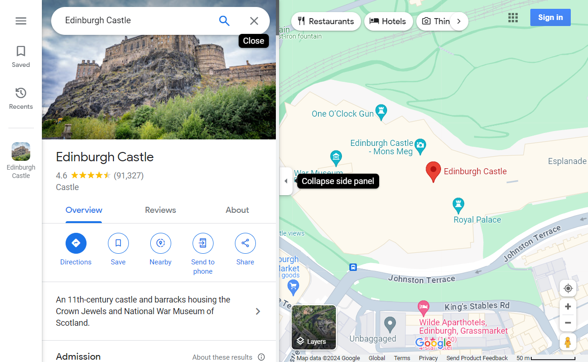
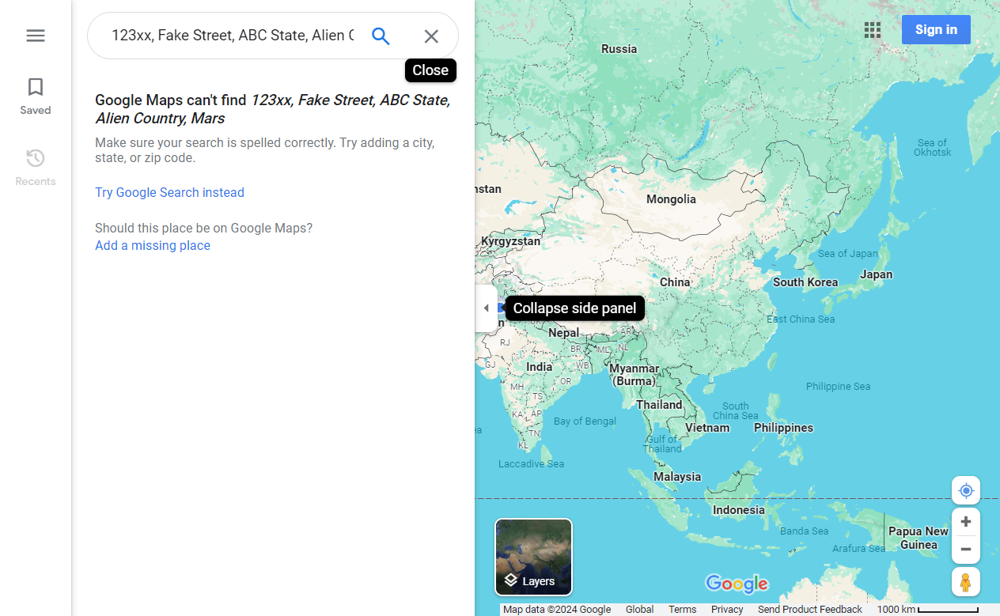
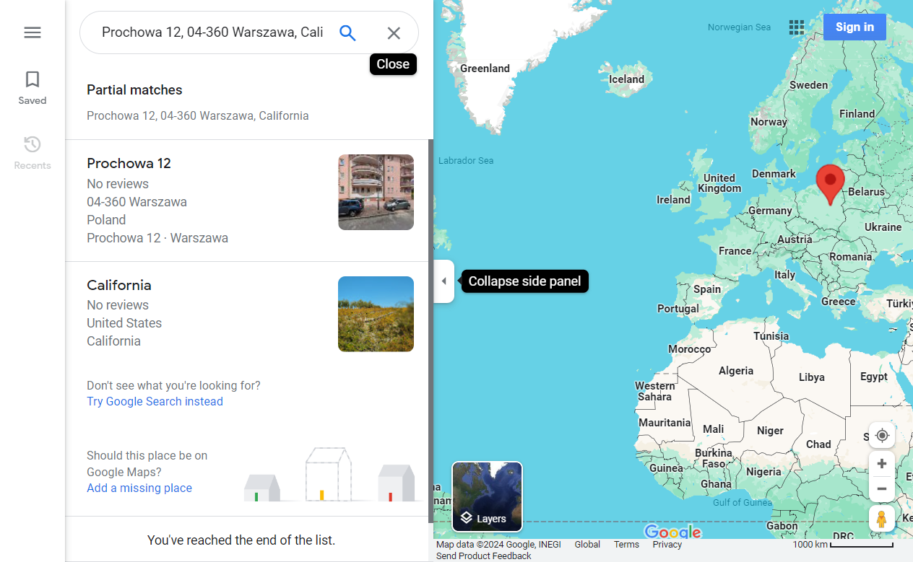
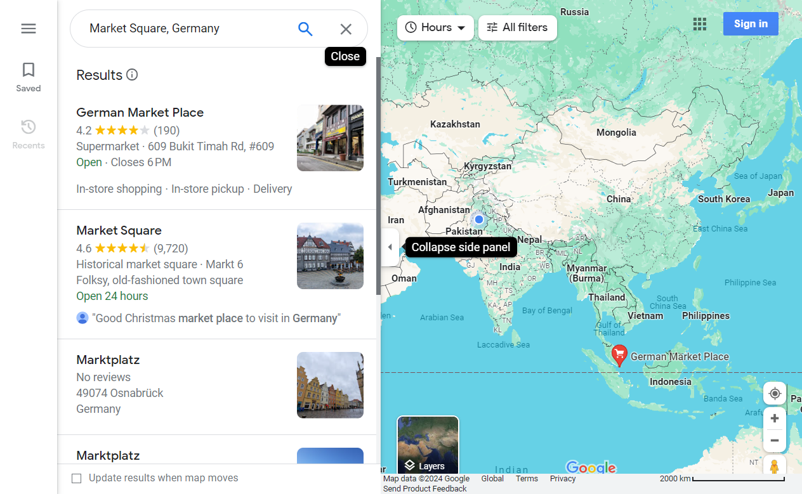
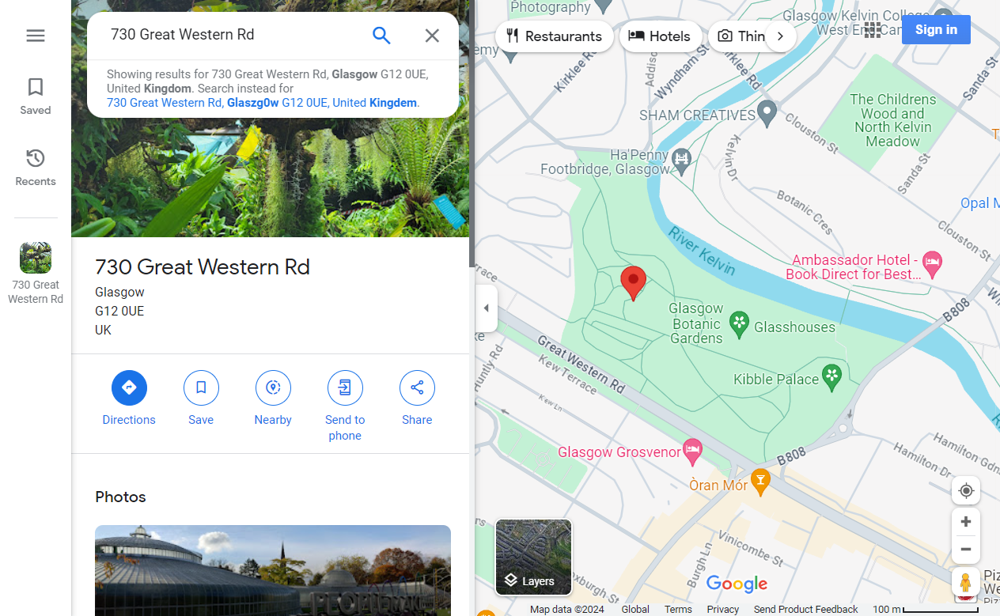
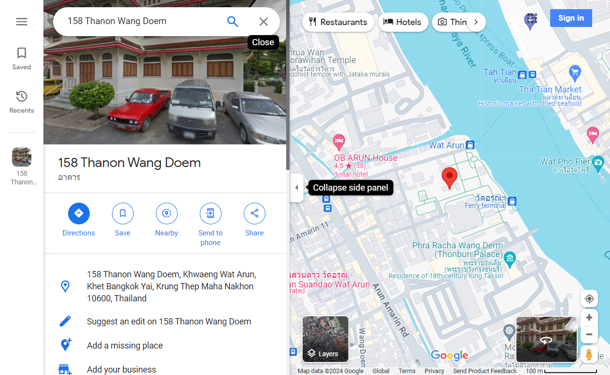
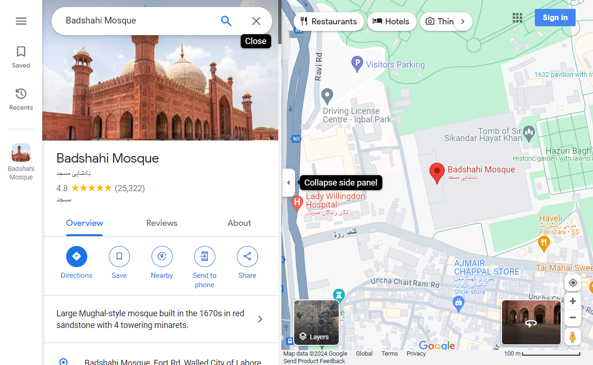

### Test Case ID: GM1

**Test Scenario**: Searching for an address displays the correct result.

**Test Steps**:
1. Navigate to https://www.google.com/maps.
2. Search for an address text on Google Maps.
3. Wait for the search results to load.

**Preconditions**:
1. The test browser's geolocation is mocked to Latitude: 32.0646 Longitude: 72.6978 to ensure consistent search results when the test is executed from different locations.
2. The test browser's window size is set to 1024x768 to ensure consistent coordinates across different display resolutions.
3. Google Maps should be fully zoomed out before a search query is performed to access the zoom-in behaviour later.

**Expected Results**:
1. The search should display a single valid result.
2. The map should be zoomed in and the map scale should be updated accordingly.
3. The location shown should have the correct coordinates.
4. The address shown for the search result should match the search query.
5. The action buttons for the search result should be visible and valid.

**Test Data Example**:
- Address: "29-M, Civic Center Block M Commercial Area, Model Town, Lahore"
- Coordinates: Latitude 52.5285867, Longitude 13.4139847, Zoom Level 17

**Test Environment:**
- Google Chrome
- Microsoft Edge

**Screenshot:**

### Test Case ID: GM2

**Test Scenario**: Searching for a landmark displays the correct result.

**Test Steps**:
1. Navigate to https://www.google.com/maps.
2. Search for a landmark text on Google Maps.
3. Wait for the search results to load.

**Preconditions**:
1. The test browser's geolocation is mocked to Latitude: 32.0646 Longitude: 72.6978 to ensure consistent search results when the test is executed from different locations.
2. The test browser's window size is set to 1024x768 to ensure consistent coordinates across different display resolutions.
3. Google Maps should be fully zoomed out before a search query is performed to access the zoom-in behaviour later.

**Expected Results**:
1. The search should display a single valid result.
2. The map should be zoomed in and the map scale should be updated accordingly.
3. The landmark shown should have the correct coordinates.
4. The landmark title displayed should match the search query.
5. The action buttons for the landmark should be visible and valid.

**Test Data Example**:
- Landmark: "Edinburgh Castle"
- Coordinates: Latitude 13.5285867, Longitude 43.4139847, Zoom Level 17

**Test Environment:**
- Google Chrome
- Microsoft Edge

**Screenshot:**

### Test Case ID: GM3

**Test Scenario**: Searching with an invalid address or landmark displays no result.

**Test Steps**:
1. Navigate to https://www.google.com/maps.
2. Search for an invalid or non-existent location on Google Maps.
3. Wait for the search results to load.

**Preconditions**:
1. The test browser's geolocation is mocked to Latitude: 32.0646 Longitude: 72.6978 to ensure consistent search results when the test is executed from different locations.
2. The test browser's window size is set to 1024x768 to ensure consistent coordinates across different display resolutions.
3. Google Maps should be fully zoomed out before a search query is performed to access the zoom-in behaviour later.

**Expected Results**:
1. The search should display no result.
2. The map should not be zoomed in and the map scale should not be updated.
3. The map coordinates should not be updated.
4. Correct error message "Google Maps can't find..." should be displayed.

**Test Data Example**:
- Search Text: "Street 334, House x64, Fake City, Fake Country", "invalid landmark abcxyz"

**Test Environment:**
- Google Chrome
- Microsoft Edge

**Screenshot:**

### Test Case ID: GM4

**Test Scenario**: Searching with a partially valid address displays partial matches and info.

**Test Steps**:
1. Navigate to https://www.google.com/maps.
2. Search for a partially valid address on Google Maps.
3. Wait for the search results to load.

**Preconditions**:
1. The test browser's geolocation is mocked to Latitude: 32.0646 Longitude: 72.6978 to ensure consistent search results when the test is executed from different locations.
2. The test browser's window size is set to 1024x768 to ensure consistent coordinates across different display resolutions.
3. Google Maps should be fully zoomed out before a search query is performed to access the zoom-in behaviour later.

**Expected Results**:
1. The search should display multiple matching results.
3. The search results should loosely match the search query.
4. The "Partial matches" info message below the search bar should displayed.
5. Info message with other search options should be displayed at the end of search results. "Don't see what you're looking for?..."

**Test Data Example**:
- Partially valid address: "Prochowa 12, 04-360 Warszawa, California"
Note that a partially valid address is mostly composed of two valid addresses. In this example, "Prochowa 12, 04-360 Warszawa, Poland" is a valid address in Poland and "California" is a valid state in the US.

**Test Environment:**
- Google Chrome
- Microsoft Edge

**Screenshot:**

### Test Case ID: GM5

**Test Scenario**: Searching with an ambiguous address displays multiple search results.

**Test Steps**:
1. Navigate to https://www.google.com/maps.
2. Search for a partially valid address on Google Maps.
3. Wait for the search results to load.

**Preconditions**:
1. The test browser's geolocation is mocked to Latitude: 32.0646 Longitude: 72.6978 to ensure consistent search results when the test is executed from different locations.
2. The test browser's window size is set to 1024x768 to ensure consistent coordinates across different display resolutions.
3. Google Maps should be fully zoomed out before a search query is performed to access the zoom-in behaviour later.

**Expected Results**:
1. The search should display multiple matching results.
2. The search results should loosely match the search query.
3. The map is zoomed in to the search results and the map scale should be updated accordingly.

**Test Data Example**:
- Ambiguous address: "Market Square, Germany"

**Test Environment:**
- Google Chrome
- Microsoft Edge

**Screenshot:**

### Test Case ID: GM6

**Test Scenario**: Searching with typos in an address or landmark displays correct results with typo info.

**Test Steps**:
1. Navigate to https://www.google.com/maps.
2. Search for a valid address with typos on Google Maps.
3. Wait for the search results to load.

**Preconditions**:
1. The test browser's geolocation is mocked to Latitude: 32.0646 Longitude: 72.6978 to ensure consistent search results when the test is executed from different locations.
2. The test browser's window size is set to 1024x768 to ensure consistent coordinates across different display resolutions.
3. Google Maps should be fully zoomed out before a search query is performed to access the zoom-in behaviour later.

**Expected Results**:
1. The system should identify the typo and show the info "Showing results for -- instead of --".
2. The valid search text and the search text with typos should be similar.
3. The search should display a single valid result.
4. The map should be zoomed in and the map scale should be updated accordingly.
5. The location shown should have the correct coordinates.
6. The action buttons for the search result should be visible and valid.

**Test Data Example**:
- Address with typos: "730 Great Western Rd, Glaszg0w G12 0UE, United Kingdem"

**Test Environment:**
- Google Chrome
- Microsoft Edge

**Screenshot:**

### Test Case ID: GM7

**Test Scenario**: Searching using an address in another language displays the correct result.

**Test Steps**:
1. Navigate to https://www.google.com/maps.
2. Search for an address text in a language other than the default language on Google Maps.
3. Wait for the search results to load.

**Preconditions**:
1. The test browser's geolocation is mocked to Latitude: 32.0646 Longitude: 72.6978 to ensure consistent search results when the test is executed from different locations.
2. The test browser's window size is set to 1024x768 to ensure consistent coordinates across different display resolutions.
3. Google Maps should be fully zoomed out before a search query is performed to access the zoom-in behaviour later.
4. Google Maps default language is set to English.

**Expected Results**:
1. The search query should automatically be translated to the default language.
2. The translated address text should be correct i.e. it should match the expected English translation.
1. The search should display a single valid result.
2. The map should be zoomed in and the map scale should be updated accordingly.
3. The location shown should have the correct coordinates.
4. The address shown for the search result should match the search query.
5. The action buttons for the search result should be visible and valid.

**Test Data Example**:
- Address: "158 ถ.วังเดิม วัดอรุณ บางกอกใหญ่ กรุงเทพฯ 10600 ประเทศไทย" (Thai)
- Translation: "158 Thanon Wang Doem, Wat Arun, Bangkok Yai, Bangkok 10600, Thailand"
- Coordinates: Latitude 5.5285867, Longitude 67.4139847, Zoom Level 17

**Test Environment:**
- Google Chrome
- Microsoft Edge

**Screenshot:**

### Test Case ID: GM8

**Test Scenario**: Searching using a landmark in another language displays the correct result.

**Test Steps**:
1. Navigate to https://www.google.com/maps.
2. Search for a landmark text on Google Maps.
3. Wait for the search results to load.

**Preconditions**:
1. The test browser's geolocation is mocked to Latitude: 32.0646 Longitude: 72.6978 to ensure consistent search results when the test is executed from different locations.
2. The test browser's window size is set to 1024x768 to ensure consistent coordinates across different display resolutions.
3. Google Maps should be fully zoomed out before a search query is performed to access the zoom-in behaviour later.
4. Google Maps default language is set to English.

**Expected Results**:
1. The search query should automatically be translated to the default language.
2. The translated landmark heading should be correct i.e. it should match the expected English translation.
3. The landmark subheading should match the original search query text.
4. The search should display a single valid result.
5. The map should be zoomed in and the map scale should be updated accordingly.
6. The landmark shown should have the correct coordinates.
7. The landmark title displayed should match the search query.
8. The action buttons for the landmark should be visible and valid.

**Test Data Example**:
- Landmark: "بادشاہی مسجد" (Urdu)
- Translation: "Badshahi Mosque"
- Coordinates: Latitude 31.5285867, Longitude 74.4139847, Zoom Level 17

**Test Environment:**
- Google Chrome
- Microsoft Edge

**Screenshot:**

